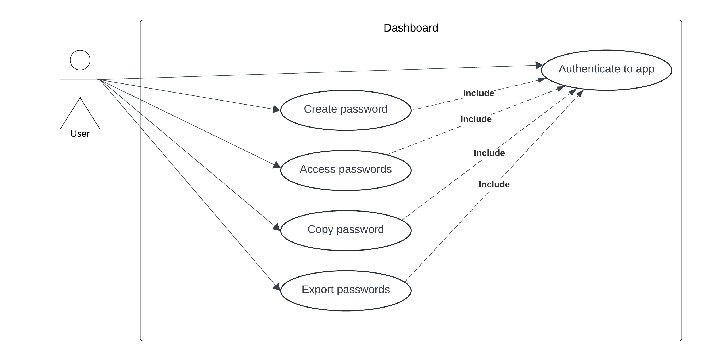

# PasswordManagerApp

Ce projet prend place dans le cadre du cours de developpement desktop en bachelor 3.
Le système de gestion de mots de passe est une application de bureau qui permet de stocker et de gérer les mots de 
passes d'un utilisateur.

## Contributeurs

- **Tom FREGONESE**
- **Enzo CHAMANIER**
- **Fatim DICKO**


## Table des matières

- [Structure du projet](#structure-du-projet)
- [Installation](#installation)
- [Utilisation](#utilisation)


## Structure du projet

Voici un aperçu de la structure du projet :

```
   PasswordManagerApp/
   ├── src/ 
   │ ├── app/ 
   │ │ ├── components/
   │ │ ├── guards/
   │ │ ├── models/
   │ │ ├── pages/
   │ │ ├── services/
   │ │ ├── app.component(.html .scss .ts)
   │ │ └── ...
   │ ├── assets/
   │ ├── index.html
   │ ├── main.ts
   ├── package.json
   └── README.md
```


## Installation

Pour installer et lancer le projet en local, suivez les étapes ci-dessous :

1. Clonez le dépôt :
   ```bash
    git clone https://github.com/tomFregonese/PasswordManagerApp.git
    cd PasswordManagerApp
   ```

2. Installez les dépendances et lancer l'app :

   ```bash
    npm install
    npm run electron
   ```

3. L'application de bureau doit s'ouvrir.


## Utilisation

Les utilisateur doivent renseigner un premier mot de passe pour accéder à l'application.
Ils peuvent en suite se connecter pour accéder à leur mots de passe, en ajouter de nouveaux, les copier et les exporter.

